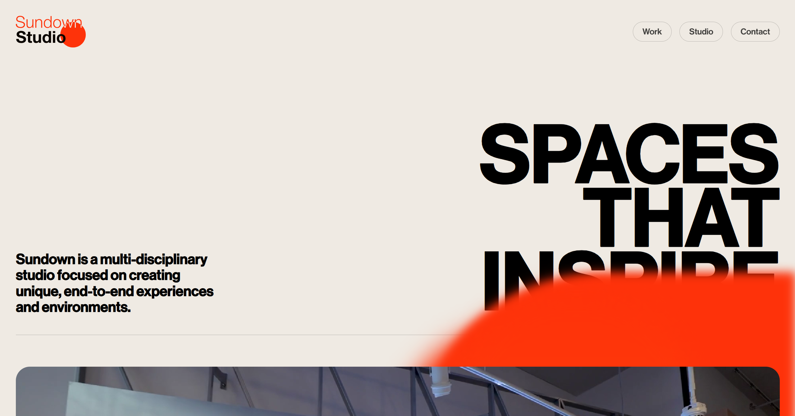

# Animation Website 🎬

A visually stunning clone of the original [Sundown Studio](https://www.sundown-studio.com/) website. This project was built to explore and understand advanced CSS animations and smooth interactions. The animations and transitions on the original site stood out as truly impressive, which inspired this project.

---
## 📸 Screenshot



---

## 📝 Description

This project is a clone of the **Sundown Studio** website, focused on replicating its exceptional animations and sleek visual style. The goal was to learn modern animation techniques using CSS and JavaScript while building a beautiful and responsive frontend.

---

## 💡 Features

- 🔄 Smooth scroll-based animations
- 🖱️ Interactive hover effects
- 📱 Fully responsive layout
- 🎨 CSS transitions and transformations
- 💫 Page loading and element fade-in animations
- 🧩 Modular and clean code structure for scalability

---

## 🛠️ Tech Stack

- **HTML5** – Semantic structure
- **CSS3** – Styling and layout
- **CSS Animations** – Motion and transitions
- **JavaScript** – Interaction

---

## 📦 How to Use

1. **Clone the repository**
   ```bash
   git clone https://github.com/your-username/animation-website.git
   cd animation-website
